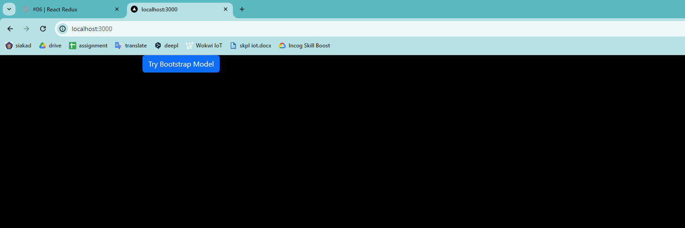
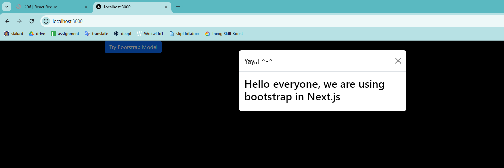
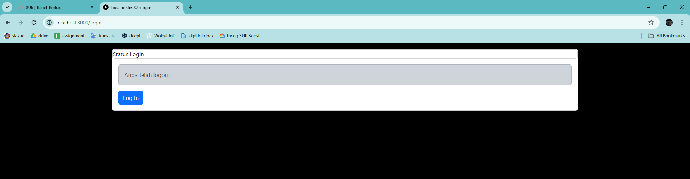
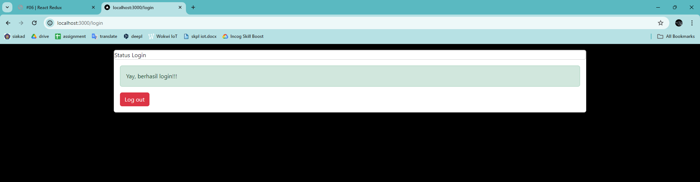
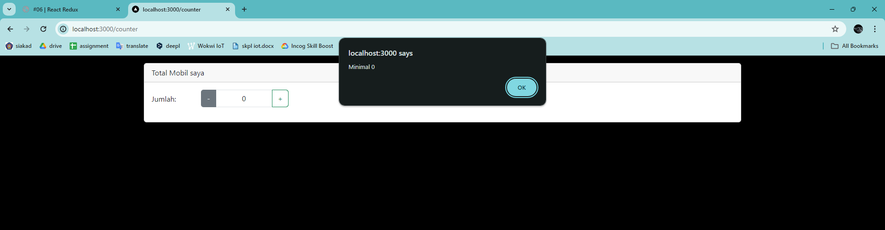

# Laporan Praktikum
| MatKul | Pemrograman Berbasis Framework |
| ---    | ---           |
| Nama   | Faricha Aulia |
| NIM    | 2141720155    |
| Kelas  | TI - 3I       |

<table><tr><td>Saya melampirkan screenshot dari setiap step yang saya lakukan pada src/assets</td></tr></table>

## Praktikum 1
> "Coba kita jalankan project next.js kita, dan laporkan apa yang terjadi?"

---

## Praktikum 2
> "Jalankan project kita di browser!"

**Pertanyaan**
> "1. Coba akses http://localhost:3000/login, dan klik tombol login. Kemudian lakukan refresh page berkali-kali (jika perlu restart npm run dev nya). Simpulkan apa yang terjadi ?"  
> "2. Baris 25 dan 30 terdapat method parse(), apa yang terjadi jika kita tidak menggunakan method tersebut?"

**Jawaban**
1. Ketika mengakses http://localhost:3000/login dan menekan tombol login, data login akan disimpan dalam state Redux store. Jika melakukan refresh halaman atau merestart npm run dev, data login tersebut akan tetap tersimpan di dalam Redux store karena kita menggunakan redux-persist untuk menyimpan data di penyimpanan lokal (local storage).
2. Metode parse() digunakan untuk mengonversi string HTML menjadi elemen React yang dapat ditampilkan. Jika tidak menggunakan metode parse(), maka string HTML akan ditampilkan sebagai teks biasa di halaman web, bukan elemen HTML yang dirender dengan benar. Dengan menggunakan parse(), string HTML dapat dirender dengan benar sebagai elemen HTML di dalam aplikasi React.

---

## Praktikum 3
> "Kemudian kita jalankan di browser dengan url localhost:3000/counter, dan amati apa yang terjadi?"

**Penyebab error dan penyelesaiannya :**
Tampilan counter dengan nilai awal 0. Ketika menekan tombol "Naik" atau "Turun", nilai counter akan berubah sesuai dengan aksi yang didispatch ke Redux store. 

--- 

## Tugas 

**Pertanyaan Praktikum**
> "1. Apa kegunaan dari kode ini import { useEffect } from "react"; Pada file pages/_app.tsx? jelaskan"  
> "2. Jika pada file pages/_app.tsx kita tidak menggunakan useEffect (menghapus baris 3, dan baris 9-11, apa yang akan terjadi?"  
> "3. Mengapa di react/nextjs penulisan tag html untuk class, harus diganti menjadi className ?"  
> "4. Apakah store pada nextjs bisa menyimpan banyak redux reducer?"  
> "5. Jelaskan kegunaan dari file store.js!"  
> "6. Pada file pages/login.tsx, apa maksud dari kode ini ? const { isLogin } = useSelector((state) => state.auth);"  
> "7. Pada file pages/counter.tsx, apa maksud dari kode ini?const {totalCounter} = useSelector((state) => state.counter);"  

**Jawaban Pertanyaan Praktikum**
1. import { useEffect } from "react"; pada file pages/_app.tsx digunakan untuk mengimpor hook useEffect dari React. Hook useEffect adalah salah satu fitur dalam React yang memungkinkan kita untuk menjalankan efek samping (side effect) dalam komponen fungsional. Efek samping dapat berupa mengubah DOM secara langsung, memulai permintaan jaringan, atau menjalankan langganan (subscription).
2. Jika kita tidak menggunakan useEffect pada file pages/_app.tsx, maka aplikasi tetap akan berjalan, tetapi Redux store tidak akan dipersistensikan (disimpan) ke dalam penyimpanan lokal (local storage). Ini berarti setiap kali halaman dimuat ulang atau aplikasi dibuka kembali, state Redux akan diinisialisasi ulang ke nilai awalnya.
3. Dalam React/NextJS, tag HTML class untuk menerapkan gaya CSS pada elemen harus ditulis sebagai className. Ini karena class adalah kata kunci yang sudah digunakan dalam JavaScript, dan React menggunakan sintaks JSX yang didasarkan pada JavaScript. Untuk menghindari konflik dengan kata kunci class, React menggunakan className sebagai pengganti.
4. Ya, store pada NextJS dapat menyimpan banyak Redux reducer. Dalam konfigurasi store Redux, kita dapat mengombinasikan beberapa reducer menggunakan fungsi combineReducers dari Redux. Setiap reducer akan menangani bagian state tertentu dari aplikasi, sehingga kita dapat memisahkan logika dan state aplikasi dengan baik.
5. File store.js digunakan untuk mengonfigurasi dan membuat instance Redux store untuk aplikasi. Dalam file ini, kita mengkonfigurasi reducer yang akan digunakan dalam aplikasi, middleware (jika ada), dan enhancer (seperti Redux DevTools Extension). Selain itu, file ini juga mengonfigurasi persistensi state Redux menggunakan redux-persist. Setelah konfigurasi selesai, instance Redux store diekspor agar dapat digunakan di seluruh aplikasi.
6. Kode const { isLogin } = useSelector((state) => state.auth); pada file pages/login.tsx mengambil nilai isLogin dari state Redux yang disimpan dalam slice auth. useSelector adalah hook yang disediakan oleh React-Redux untuk mengakses state dari Redux store. Dalam kasus ini, useSelector mengambil seluruh state dari store dan mengembalikan bagian state yang terkait dengan slice auth. Kemudian, isLogin didestrukturisasi dari state auth.
7. Kode const {totalCounter} = useSelector((state) => state.counter); pada file pages/counter.tsx memiliki tujuan yang sama seperti kode pada nomor 6, tetapi dalam hal ini, kita mengambil nilai totalCounter dari slice counter di dalam state Redux. useSelector mengakses seluruh state dari Redux store, dan mengembalikan bagian state yang terkait dengan slice counter. Kemudian, totalCounter didestrukturisasi dari state counter.
